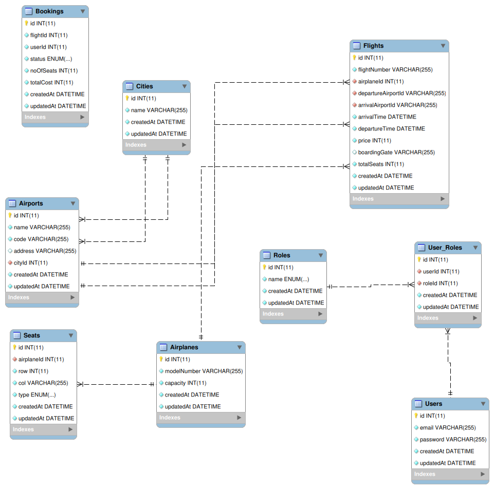

# Flight Booking System

## Live

<!-- The deployed application can be fetched at [flights.keshavcarpenter.tech](https://flights.keshavcarpenter.tech/api/v1/info). -->
<!-- Please refer to the Postman Docs to understand the APIs and try out [Postman Collection](https://documenter.getpostman.com/view/27853841/2sA3XJmkR8) -->

## Description

This is an Airline managemnet and flight booking system based on microservices architecture. It has 4 microservices:

1. Flight Service
2. Booking Service
3. Authentication/API Gateway Service
4. Notification Service

## Non Functional Requirements

Non functional Requirements

1.  We can expect more flight searching than bookings
2.  The system needs to be reliable in terms of booking
3.  Expect that we will be having 100k total users.
4.  100k bookings might come up in quarter
5.  In one day you might be getting 100 bookings
6.  System should make sure that we don?t change the prices where the
    booking payment is going on.
7.  System should be able to auto scale itself atleast for 3x more traffic.

## System Design


## ER Diagram

### For Flights DB



### For Notification DB


## Functionalities

1. Flight Service : CRUD operations on all flight db models
2. Booking Service : Book or cancel a booking
3. Notification Service : Send email notifications to users on booking, cancellation. Run CRON jobs to check for upcoming flights and send notifications.
4. Authentication/API-Gateway Service : Signin, Signup, Reverse proxy for Flight Search and Booking Service

## Project Explanation

The Flight Service Backend Project is based on a microservice architecture, comprising four distinct microservices that collectively provide a comprehensive flight management system.

The first microservice, Flight Service, acts as the core component and encompasses multiple models, including airplane, airport, city, flight, and seat models. This microservice handles all the essential functionalities related to flights, airports, and cities. It enables efficient scheduling and allocation of airplanes, manages flight routes and durations, and facilitates seat reservations for passengers.

The second microservice, Flight Booking Service, focuses on the booking process and includes the booking model. It incorporates cron jobs that run every 30 minutes to automatically check for pending or initiated bookings with expired payment times. In such cases, the bookings are automatically canceled. Additionally, this microservice utilizes RabbitMQ to send booking information to a queue for further processing by the fourth microservice.

The third microservice, Flight API Gateway Service, provides a centralized entry point for accessing the flight service's functionalities. It incorporates user and role models for managing user information and permissions. This microservice includes features such as rate limiting to control API usage, reverse proxy for efficient routing, authentication system using JWT (JSON Web Tokens) for user authentication, and an authorization system to ensure access control based on user roles.

The fourth microservice, Flight Notification Service, is responsible for sending notifications to users regarding their flight bookings. Once a booking is successfully processed and confirmed, the second microservice sends the relevant information to a queue. The Flight Notification Service then consumes the messages from the queue and uses Node Mailer to send emails to users, providing them with details about their successful bookings.

Collectively, these microservices work together to create a robust flight management system. The Flight Service microservice handles flight-related operations and models, the Flight Booking Service automates booking cancellations and manages booking queues, the Flight API Gateway Service provides a secure and efficient gateway for user interactions, and the Flight Notification Service ensures timely and accurate notifications to users via email.

# Flight Booking System - Microservices Setup Guide

This guide provides comprehensive instructions for setting up and running our Flight Booking System microservices architecture. Follow these steps carefully to ensure a smooth setup process.

## Prerequisites

Before you begin, make sure you have the following installed:

- Node.js (v14 or later)
- npm (v6 or later)
- MySQL (v8 or later)
- RabbitMQ (v3.8 or later)
- Git

## Setup Instructions

### 1. Clone the Repository

```bash
git clone https://github.com/your-username/flight-booking-microservices.git
cd flight-booking-microservices
```

### 2. Install Dependencies

Navigate to each microservice directory and install its dependencies:

```bash
cd auth-service && npm install
cd ../booking-service && npm install
cd ../flight-service && npm install
# Repeat for all microservices
```

### 3. Database Configuration

#### 3.1 Initialize Sequelize (if needed)

If the Sequelize configuration files are not present (due to privacy reasons), initialize them:

```bash
npx sequelize-cli init
```

This will create `config/config.json` and other necessary files.

#### 3.2 Configure Database

Edit `config/config.json` in each microservice to set up your database configuration:

```json
{
  "development": {
    "username": "your_db_username",
    "password": "your_db_password",
    "database": "flight_booking_dev",
    "host": "127.0.0.1",
    "dialect": "mysql"
  }
  // ... other environments
}
```

### 4. Environment Variables

Create a `.env` file in each microservice directory based on the reference of `.env.example` `config/server-config` file:

```bash
cp .env.example .env
```

Edit the `.env` file to include all necessary environment variables:
Example

```
PORT=3004
FLIGHT_SERVICE=http://localhost:3001
GMAIL_PASSWORD=random-password
GMAIL_EMAIL=randomemail@gmail.com
FLIGHT_SERVICE=http://localhost:3000
BOOKING_SERVICE=http://localhost:3001
JWT_EXPIRY=24h
JWT_SECRET_KEY=random-secret-key
# Add other required variables
```

### 5. Database Migration and Seeding

Run migrations to create database schema:

```bash
npx sequelize  db:migrate
```

Seed the database with initial data:

```bash
npx sequelize db:seed:all
```

### 6. RabbitMQ Configuration

Ensure RabbitMQ is installed and running. Configure the RabbitMQ URL in the `.env` file of microservices that use it:

```
RABBITMQ_URL=amqp://localhost
```

### 7. Starting the Microservices

Start each microservice in a separate terminal:

```bash
# Terminal 1
cd auth-service && npm start

# Terminal 2
cd booking-service && npm start

# Terminal 3
cd flight-service && npm start

# Repeat for other microservices
```

Ensure each service is running on a different port as specified in their respective configurations.

## Testing

You can test the APIs using Postman or any API testing tool. Here's a basic example:

## Troubleshooting

- If you encounter database connection issues, ensure your MySQL server is running and the credentials in `config.json` are correct.
- For RabbitMQ connection problems, check if the RabbitMQ server is running and the URL in the `.env` file is correct.
- If a service fails to start, check the console output for error messages and ensure all dependencies are correctly installed.

## Tech Stack

1.  NodeJS
2.  ExpressJS
3.  MySQL
4.  Sequelize
5.  RabbitMQ
6.  NodeMailer
7.  JWT
